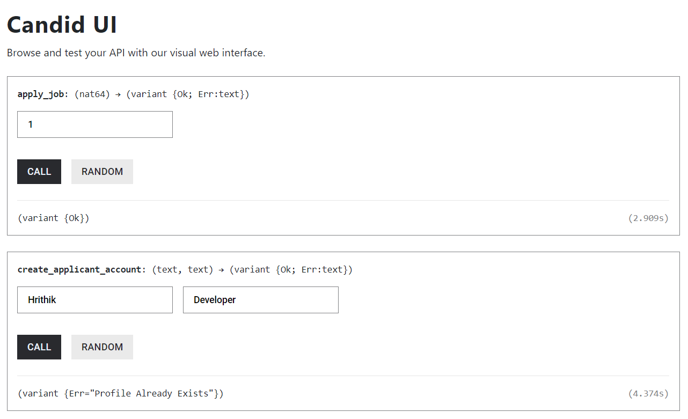
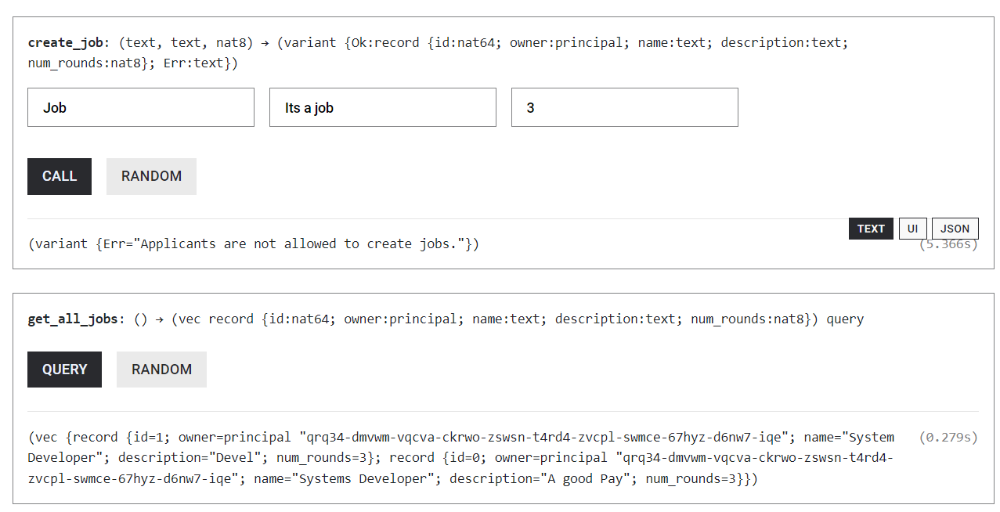
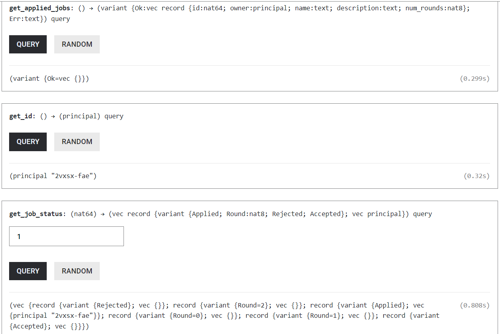
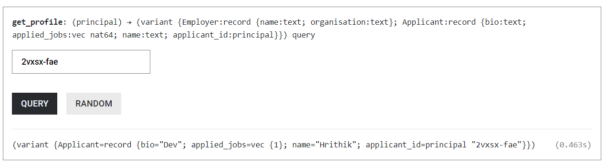
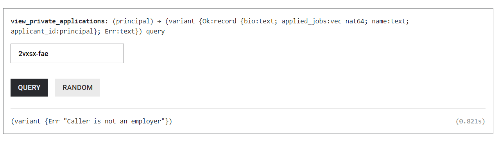
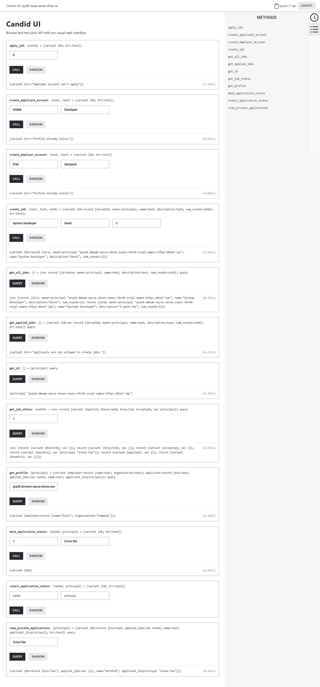
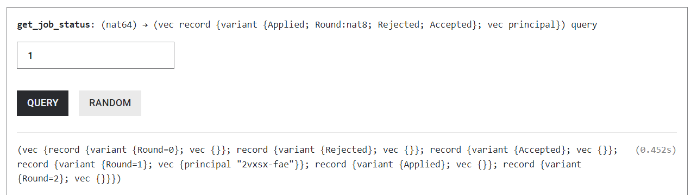
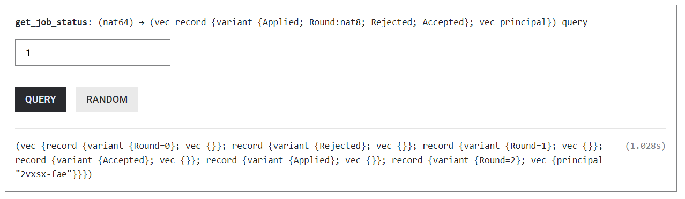
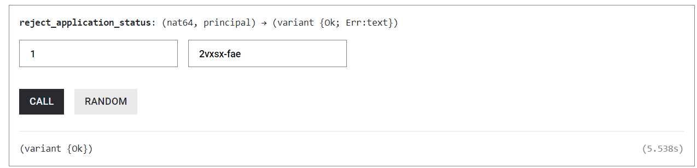
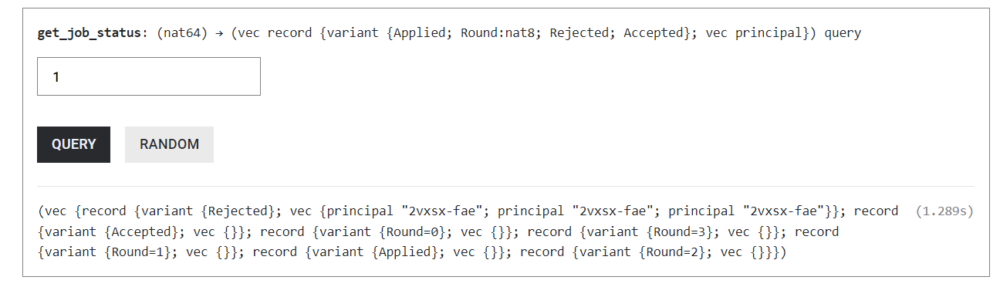

# dapphire_rust_backend

Built DappHire, A web3 version of Hiring Applications like Workday but here you can see the status of your and other applicants. This reduces the anticipation to applicants as well as reduces the headache  of Talent Acquisition Teams to inform Applicants about the Status.

I have used ICP to store the state of the jobs and have also stored the state of the Applicants as well as Employers in the Talent Acquisition . I also deployed the update and query functions in the canisters.


## Images of application Account











## Images of Employer Account



### Moving an Application

Previous State has one Applicant in Round 1



Now I will click Move Applicant


After it I will again check the job status



You will be able to see that it has moved its application state to Round=2 variant

### Rejecting an application

Taking the same previous state and then clicking Reject with the job Id and id of the applicant



Now the state of the job status is this




# Get Started
Welcome to your new dapphire_rust_backend project and to the internet computer development community. By default, creating a new project adds this README and some template files to your project directory. You can edit these template files to customize your project and to include your own code to speed up the development cycle.

To get started, you might want to explore the project directory structure and the default configuration file. Working with this project in your development environment will not affect any production deployment or identity tokens.

To learn more before you start working with dapphire_rust_backend, see the following documentation available online:

- [Quick Start](https://internetcomputer.org/docs/current/developer-docs/setup/deploy-locally)
- [SDK Developer Tools](https://internetcomputer.org/docs/current/developer-docs/setup/install)
- [Rust Canister Development Guide](https://internetcomputer.org/docs/current/developer-docs/backend/rust/)
- [ic-cdk](https://docs.rs/ic-cdk)
- [ic-cdk-macros](https://docs.rs/ic-cdk-macros)
- [Candid Introduction](https://internetcomputer.org/docs/current/developer-docs/backend/candid/)

If you want to start working on your project right away, you might want to try the following commands:

```bash
cd dapphire_rust_backend/
dfx help
dfx canister --help
```

## Running the project locally

If you want to test your project locally, you can use the following commands:

```bash
# Starts the replica, running in the background
dfx start --background

# Deploys your canisters to the replica and generates your candid interface
dfx deploy
```

Once the job completes, your application will be available at `http://localhost:4943?canisterId={asset_canister_id}`.

If you have made changes to your backend canister, you can generate a new candid interface with

```bash
npm run generate
```

at any time. This is recommended before starting the frontend development server, and will be run automatically any time you run `dfx deploy`.

If you are making frontend changes, you can start a development server with

```bash
npm start
```

Which will start a server at `http://localhost:8080`, proxying API requests to the replica at port 4943.

### Note on frontend environment variables

If you are hosting frontend code somewhere without using DFX, you may need to make one of the following adjustments to ensure your project does not fetch the root key in production:

- set`DFX_NETWORK` to `ic` if you are using Webpack
- use your own preferred method to replace `process.env.DFX_NETWORK` in the autogenerated declarations
  - Setting `canisters -> {asset_canister_id} -> declarations -> env_override to a string` in `dfx.json` will replace `process.env.DFX_NETWORK` with the string in the autogenerated declarations
- Write your own `createActor` constructor

### Future Goals

1. Complete the Frontend

2. Allow Jobs to be bundled in an Organization and using the organiztation the account is registered to , its members can change the status of applicants and Show Jobs of an Organization

3.  Option to add Resume and Cover Letter

### Deployment Link

https://a4gq6-oaaaa-aaaab-qaa4q-cai.raw.icp0.io/?id=ayzdb-laaaa-aaaak-afnja-cai